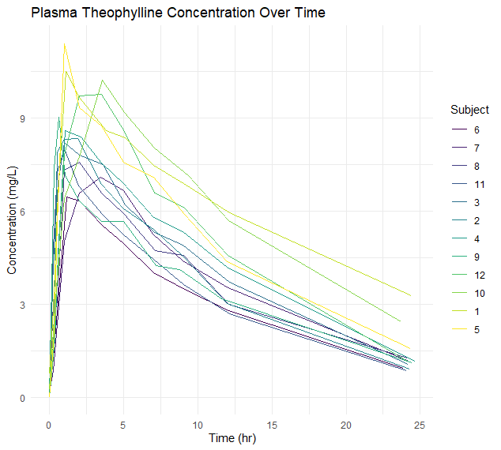
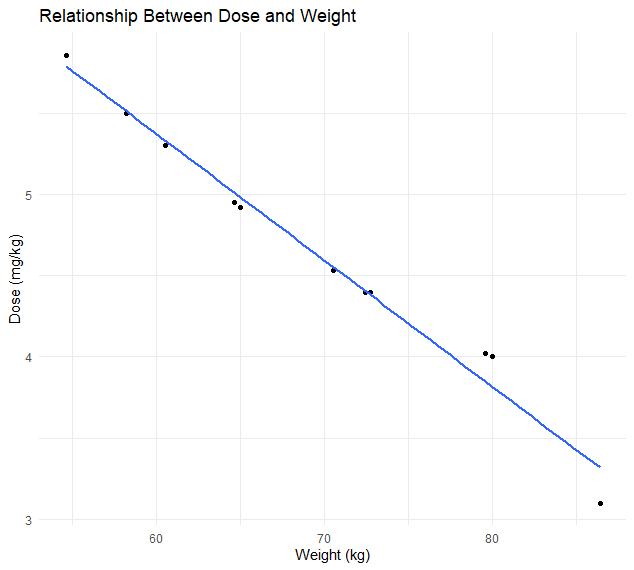
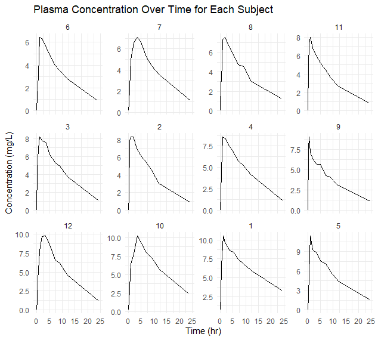
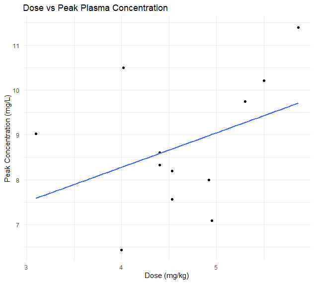

# Pharmacokinetics of Theophylline using R-Studio

## Overview
This dataset contains information from a pharmacokinetic study involving 12 healthy volunteer subjects who were administered oral theophylline. Theophylline, a methylxanthine anti-asthma medication, functions as a bronchodilator and has secondary effects such as strengthening diaphragm contraction, reducing pulmonary artery pressures, and decreasing mast cell release. It can be administered intravenously, orally, or via rectal suppositories. Plasma levels of theophylline in the blood vary significantly among patients due to differences in drug clearance, influenced by factors such as body mass, age, smoking habits, liver and heart function, and viral infections. Furthermore, theophylline interacts with several common medications, which can alter its plasma concentration. In this study, each subject received a single oral dose of 300 mg of theophylline, converted to a milligrams per kilogram dose. Blood samples were collected frequently over the subsequent 25 hours, and the theophylline concentration in plasma was measured in micrograms per milliliter.

## Analysis

### Plasma Theophylline Concentration Over Time 

1. This plot shows the plasma theophylline concentration over time for all subjects.
2. We can see that the concentration generally increases initially, reaches a peak, and then gradually decreases.
3. The peak times and concentrations vary between subjects, indicating individual differences in how the drug is metabolized and cleared.

### Relationship Between Dose and Weight 

1. This scatter plot shows the relationship between the weight of the subjects and the dose administered.
2. Theophylline was administered at a fixed dose of 300 mg, converted to a dose per kilogram (mg/kg).
3. The linear regression line suggests a positive correlation between weight and the dose administered, as expected since the dose was adjusted based on weight.

### Plasma Theophylline Concentration Over Time for Each Subject 

1. This plot provides a more detailed view by showing the plasma concentration over time for each subject individually.
2. It highlights the variability in pharmacokinetic profiles between subjects.
3. Some subjects reach their peak concentration earlier than others, and the rate of decline in concentration also varies.

### Dose vs. Peak Plasma Theophylline Concentration

1. This plot shows the relationship between the dose (mg/kg) and the peak plasma concentration of theophylline for each subject.
2. There is a noticeable trend where higher doses correspond to higher peak concentrations, but there is considerable variability.
3. The linear regression line indicates a general positive trend, but the spread around the line suggests that other factors besides dose influence the peak concentration.